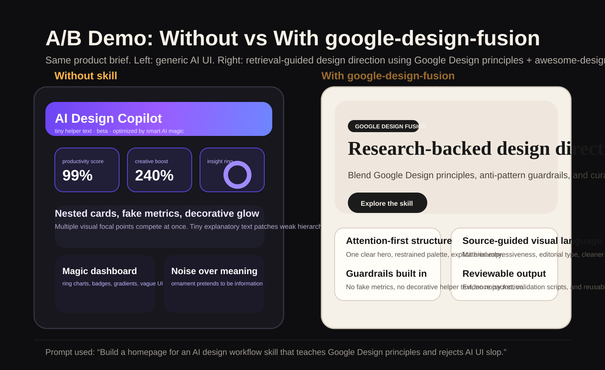

<div align="center">
  
  <h1>Google Design Fusion</h1>
  <p><strong>An open-source skill that fuses the best design thinking from <code>design.google</code> with a curated <code>DESIGN.md</code> style library to guide better front-end generation.</strong></p>
</div>

<div align="center">


</div>

<br />



## What This Skill Comes From

This skill is not a generic prompt wrapper.

It is built by combining two source systems:

1. **The design ideas, essays, systems thinking, and human-interface principles across `design.google`**
   We crawled and structured the site as a design-principles corpus, including Material, typography, accessibility, motion, AI UI, hardware/XR, and editorial design thinking.

2. **A curated `DESIGN.md` style corpus inspired by the Google Stitch / DESIGN.md workflow**
   In this workspace that layer comes from `awesome-design-md`, a large collection of public-site-inspired `DESIGN.md` samples used as visual/style seeds.

In short:

**`design.google` provides the judgment layer. `awesome-design-md` provides the style-reference layer. `google-design-fusion` connects them into one reusable skill.**

## What Problem It Solves

Most AI-generated front-end work gets trapped in a few predictable failure modes:

- too many focal points
- fake KPI cards
- decorative gradients doing all the work
- tiny helper text compensating for weak hierarchy
- motion used as ornament instead of meaning
- generic component-library layouts passed off as “finished design”

This repository exists to push generation upstream:

- retrieve stronger design evidence first
- reject common anti-patterns early
- separate principles from stylistic references
- then generate direction, prompts, or UI

## Core Architecture

The project is organized as a layered skill runtime instead of a loose folder of notes.

### 1. Principle Layer

Source:

- `design.google`
- selected high-value external references linked from legacy `design.google` pages

Purpose:

- attention management
- motion reasoning
- typography and readability
- accessibility and inclusion
- AI trust and explainability
- hardware / ambient / XR constraints

### 2. Style Layer

Source:

- `awesome-design-md`

Purpose:

- brand atmosphere
- surface language
- typography personality
- density
- geometry
- component signatures

### 3. Retrieval Layer

Implemented in:

- [skills/google-design-fusion/scripts/design_harness.py](./skills/google-design-fusion/scripts/design_harness.py)

Purpose:

- query the local corpus by phase
- retrieve ranked evidence
- inject guardrails
- return a reusable evidence packet for design work

### 4. Corpus Builder

Implemented in:

- [skills/google-design-fusion/scripts/build_design_fusion_vector_db.py](./skills/google-design-fusion/scripts/build_design_fusion_vector_db.py)

Purpose:

- crawl `design.google`
- preserve redirect/canonical facts
- selectively ingest high-value external design references
- ingest `awesome-design-md`
- build chunked sparse retrieval indexes

### 5. Validation Layer

Implemented in:

- [skills/google-design-fusion/scripts/validate_skill_contract.py](./skills/google-design-fusion/scripts/validate_skill_contract.py)
- [skills/google-design-fusion/scripts/validate_harness.py](./skills/google-design-fusion/scripts/validate_harness.py)
- [skills/google-design-fusion/scripts/validate_workspace_docs.py](./skills/google-design-fusion/scripts/validate_workspace_docs.py)
- [skills/google-design-fusion/scripts/run_full_validation.py](./skills/google-design-fusion/scripts/run_full_validation.py)

Purpose:

- keep the skill package internally coherent
- ensure harness behavior is phase-aware
- keep docs aligned with real build output

## Harness Mechanism

The harness is the heart of the skill.

It works in four steps:

1. **Build the corpus**
   Generate a local vector library from `design.google`, selected external references, and `awesome-design-md`.

2. **Query by phase**
   A request is evaluated as `research`, `concept`, `wireframe`, `ui`, `polish`, or `audit`.

3. **Apply phase-specific retrieval**
   The harness uses phase profiles, metadata weighting, per-page caps, and audit-specific query lenses so `audit` does not behave like `ui`.

4. **Return a design packet**
   The output includes:
   - phase goal
   - anti-pattern guardrails
   - ranked evidence
   - page-level deduped references

This makes the skill much more than a prompt template. It becomes a reusable design reasoning tool.

## A/B Demo

This repo includes a simple before/after demo showing the difference between:

- a generic “AI-made” front-end without retrieval-backed design guidance
- a front-end shaped with `google-design-fusion`

Artifacts:

- Without skill: [examples/without-skill/index.html](./examples/without-skill/index.html)
- With skill: [examples/with-skill/index.html](./examples/with-skill/index.html)
- Comparison image: [assets/comparison.svg](./assets/comparison.svg)

The contrast is intentional:

- **Without skill**: nested cards, fake metrics, decorative helper text, noisy gradients, weak hierarchy
- **With skill**: attention-first structure, restrained surfaces, stronger typography, clearer meaning

## Repository Layout

### 1. Skill Package

Path:

- [skills/google-design-fusion/](./skills/google-design-fusion/)

Includes:

- [SKILL.md](./skills/google-design-fusion/SKILL.md)
- [openai.yaml](./skills/google-design-fusion/agents/openai.yaml)
- references in [references/](./skills/google-design-fusion/references/)
- scripts in [scripts/](./skills/google-design-fusion/scripts/)

### 2. Local Vector Library

Path:

- [google-design-vector-db/](./google-design-vector-db/)

Current build:

- `328` `design.google` crawl records
- `248` indexed `design.google` source pages
- `32` indexed high-value external references
- `54` `awesome-design-md` samples
- `6457` retrieval chunks

### 3. Research Docs

Path:

- [research/](./research/)

Includes:

- [design-google-site-map.md](./research/design-google-site-map.md)
- [design-google-principles.md](./research/design-google-principles.md)
- [google-design-awesome-fusion.md](./research/google-design-awesome-fusion.md)
- [ai-design-antipatterns.md](./research/ai-design-antipatterns.md)
- [validation-report.md](./research/validation-report.md)

## Common Commands

Rebuild the corpus:

```bash
python skills/google-design-fusion/scripts/build_design_fusion_vector_db.py
```

Query the retrieval harness:

```bash
python skills/google-design-fusion/scripts/design_harness.py "brand-forward premium landing page typography" --phase ui --top-k 8
```

Run the full validation stack:

```bash
python skills/google-design-fusion/scripts/run_full_validation.py
```

## Publishing Notes

This repository intentionally includes the generated local vector library because the corpus is part of the skill’s practical value.

External references are only ingested when they meet a stricter bar:

- stable access
- meaningful design-learning value
- usable text extraction

Video shells, generic landing pages, and low-signal redirects stay out of the indexed corpus.

## Contributing

See [CONTRIBUTING.md](./CONTRIBUTING.md).

## License

MIT License - see [LICENSE](./LICENSE)
