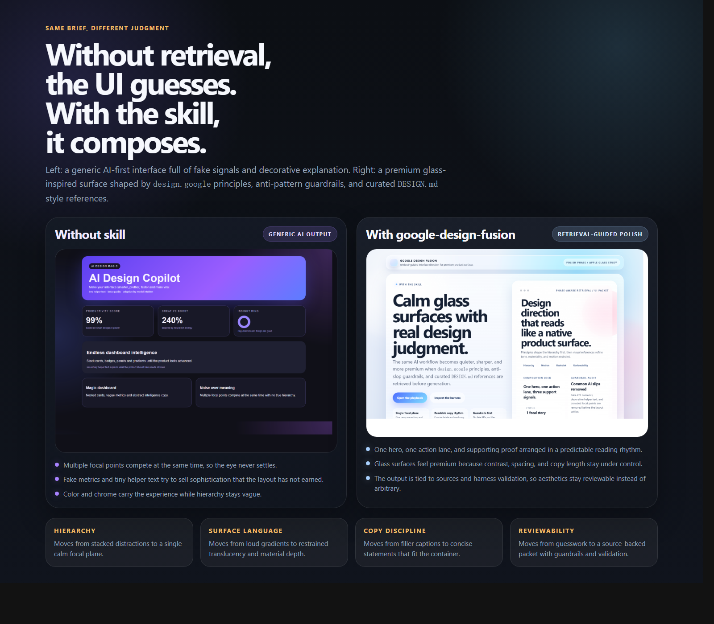

<div align="center">
  
  <h1>Google Design Fusion</h1>
  <p><strong>An open-source portable agent skill / workflow package that fuses the full <code>design.google</code> idea system with curated <code>awesome-design-md</code> / <code>DESIGN.md</code> style references, then turns that fusion into a retrieval-backed front-end design workflow.</strong></p>
  <p><a href="./README.md">English</a> | <a href="./README.zh-CN.md">简体中文</a></p>
</div>



## What It Is

`google-design-fusion` is not a prompt wrapper and not a loose folder of notes.

It is a packaged skill system with:

- a local design corpus built from `design.google`
- a fused style layer built from `awesome-design-md`
- a full local motion layer built from a vendored `uiverse-io/galaxy` snapshot
- a retrieval harness that changes behavior by design phase
- anti-AI-slop guardrails for common front-end generation mistakes
- validation scripts that keep the skill, harness, and docs aligned

The goal is simple: make AI-generated front-end work feel more intentional, more reviewable, and much less generic.

## How To Use It

Most users only need the checked-in skill and the checked-in vector library. You do not need to rebuild the corpus just to start using the project.

Use it in three layers:

### 1. Load it into your agent client

1. Clone this repository.
2. Point your agent runtime at [skills/google-design-fusion/](./skills/google-design-fusion/).
3. Keep the checked-in [google-design-vector-db/](./google-design-vector-db/) in the same workspace.

The core reusable surface is:

- [skills/google-design-fusion/SKILL.md](./skills/google-design-fusion/SKILL.md)
- [skills/google-design-fusion/references/](./skills/google-design-fusion/references/)
- [skills/google-design-fusion/scripts/](./skills/google-design-fusion/scripts/)
- [google-design-vector-db/](./google-design-vector-db/)

This repository ships two coordinated skills:

- [skills/google-design-fusion/](./skills/google-design-fusion/) = retrieval engine (`design.google` + curated style/motion corpus, retrieval packet output).
- [skills/huashu-fusion-studio/](./skills/huashu-fusion-studio/) = execution-first orchestrator (packet -> deterministic execution brief -> artifact routing).

Architecture relationship (details in [research/huashu-fusion-architecture.md](./research/huashu-fusion-architecture.md)):

- `google-design-fusion` = retrieval engine.
- `huashu-fusion-studio` = orchestrator.
- huashu-derived subset from [alchaincyf/huashu-design](https://github.com/alchaincyf/huashu-design), stored under [skills/huashu-fusion-studio/vendor/huashu-derived/](./skills/huashu-fusion-studio/vendor/huashu-derived/), = execution doctrine.

License boundary note:

- Repo code/docs are MIT unless noted.
- `skills/huashu-fusion-studio/vendor/huashu-derived/` is derived from `alchaincyf/huashu-design` and remains under upstream `Personal Use License` terms (see `LICENSE.upstream.txt` in that folder), not relicensed to MIT.
- The top-level third-party/exception ledger is [THIRD_PARTY_LICENSES.md](./THIRD_PARTY_LICENSES.md).
- The vendored huashu-derived doctrine docs are a constrained upstream subset and may reference upstream-only files that are not included in this repository snapshot.

### Compatibility

| Client | Support model | Recommended integration | Notes |
| --- | --- | --- | --- |
| `Codex` | Verified adapter | Copy or symlink the skill into `~/.codex/skills/` | Native packaging in this repo is verified on Codex. |
| `Claude Code` | Portable workflow support | Load [skills/google-design-fusion/](./skills/google-design-fusion/) as a local skill/prompt package if supported, otherwise keep the repo in the workspace and call the harness scripts directly | Reuses the same `SKILL.md`, references, scripts, and checked-in vector DB. |
| `OpenClaw` | Portable workflow support | Keep the repo in the workspace and wire the same skill folder or harness scripts into your local workflow | The core runtime is repo-local and not tied to a Codex-only prompt surface. |
| `OpenCode` | Portable workflow support | Load the same skill folder if your setup supports local prompt packages, otherwise invoke the harness scripts from the workspace | Best fit when you want retrieval-backed design packets before code generation. |

Codex PowerShell example:

```powershell
New-Item -ItemType SymbolicLink `
  -Path "$env:USERPROFILE\.codex\skills\google-design-fusion" `
  -Target (Resolve-Path ".\skills\google-design-fusion")
```

If you only want to use the skill, the checked-in [google-design-vector-db/](./google-design-vector-db/) is already ready.

### 2. Ask your agent to use it explicitly

The most reliable prompt shape is:

```text
Use google-design-fusion for [task]. Phase: [research|concept|wireframe|ui|polish|audit]. Return a retrieval-backed design packet first, then the final direction.
```

Examples:

- `Use google-design-fusion for an AI finance landing page. Phase: concept. Give me 3 distinct theses before any UI code.`
- `Use google-design-fusion to redesign this dashboard. Phase: ui. Keep one dominant task, cut fake metrics, and define motion only where it improves feedback.`
- `Use google-design-fusion to critique this existing mockup. Phase: audit. Flag hierarchy problems, tiny helper text, AI slop, and motion misuse.`
- `Use google-design-fusion for a premium Apple-style glassmorphism hero. Phase: polish. Keep the typography restrained and the motion secondary.`

### 3. Use the harness directly when you want traceable evidence

Run the harness if you want to inspect the retrieved sources before turning them into a design output:

```bash
python skills/google-design-fusion/scripts/design_harness.py "premium glassmorphism landing page with calmer hierarchy" --phase ui --top-k 8
python skills/google-design-fusion/scripts/design_harness.py "AI glasses notification motion" --phase research --top-k 8 --format json
python skills/google-design-fusion/scripts/design_harness.py "audit this enterprise dashboard for fake KPI clutter" --phase audit --top-k 8
```

Use the phases like this:

- `research`: collect principles, precedents, and constraints
- `concept`: choose a thesis and contrast directions
- `wireframe`: lock hierarchy, flow, and interaction rhythm
- `ui`: define typography, surfaces, and component language
- `polish`: refine states, copy density, finish, and motion
- `audit`: critique an existing design or prompt

### Huashu Export Prerequisites (Minimal)

When running huashu-derived export scripts (especially under `skills/huashu-fusion-studio/vendor/huashu-derived/scripts/`), keep prerequisites lightweight but explicit:

- Node.js plus vendored script dependencies from `skills/huashu-fusion-studio/vendor/huashu-derived/package.json` (`playwright@1.59.1`, `sharp@0.34.5`), for example: `cd skills/huashu-fusion-studio/vendor/huashu-derived && npm install`.
- `ffmpeg` available on `PATH` for motion/video exports (`mp4`/`gif` paths).
- If external tooling is missing, execution-brief generation still works, but export steps can fail or be skipped.

## What It Comes From

This repository combines two source systems on purpose.

### 1. Judgment Layer

Source:

- the full crawlable `design.google` surface
- selected high-value external articles linked from legacy `design.google` pages

What it contributes:

- hierarchy and attention design
- motion used for meaning, not decoration
- typography, readability, and accessibility judgment
- AI trust, explainability, and human-centered interaction thinking
- ambient, hardware, and XR constraints when relevant

### 2. Style Layer

Source:

- `awesome-design-md`

What it contributes:

- visual atmosphere
- typography personality
- density and rhythm
- surface language
- component signatures and composition references

In short:

`design.google` provides judgment. `awesome-design-md` provides style seeds. The skill fuses them into one retrieval-guided workflow.

### 3. Motion Layer

Source:

- the vendored `uiverse-io/galaxy` snapshot under `vendor/galaxy/`
- the derived `skills/google-design-fusion/galaxy-motion/` evidence layer

What it contributes:

- hover and transition references
- CTA feedback patterns
- loading and notification motion samples
- microinteraction examples that can be pulled into `ui` and `polish` flows

## Why It Exists

Most AI front-end output still falls into the same traps:

- fake KPI cards with no product meaning
- tiny helper text patching weak hierarchy
- too many focal points at once
- decorative gradients doing the explanatory work
- motion used as chrome instead of guidance
- generic component-library layouts passed off as finished design

This skill pushes the work upstream:

1. retrieve better design evidence first
2. reject common anti-patterns early
3. separate principles from style references
4. return a usable packet for concept, UI, polish, or audit work

## Validated Value

Current included corpus:

- `328` crawl records from the `design.google` site map and direct recovery passes
- `248` indexed `design.google` source pages
- `32` indexed high-value external references
- `54` `awesome-design-md` samples
- `3802` `galaxy-motion` records
- `14066` retrieval chunks in the local vector library

The generated corpus is checked into the repo because it is part of the skill's practical value, not just build output.

## Before / After

Artifacts in this repo:

- Without skill demo: [examples/without-skill/index.html](./examples/without-skill/index.html)
- With skill demo: [examples/with-skill/index.html](./examples/with-skill/index.html)
- Comparison page: [examples/comparison/index.html](./examples/comparison/index.html)
- Rendered comparison: [assets/screenshots/comparison.png](./assets/screenshots/comparison.png)

Observed difference:

| Without skill | With `google-design-fusion` |
| --- | --- |
| Stacked noise, fake metrics, decorative helper text | One dominant story, clearer hierarchy, restrained proof blocks |
| Style guessed from defaults | Style guided by retrieved references |
| No source trail | Evidence packet tied to corpus retrieval |
| Easy to drift into AI slop | Guardrails explicitly block common failure modes |

## Architecture

The repo is organized as a layered skill runtime.

### Corpus Builder

Implemented in:

- [skills/google-design-fusion/scripts/build_design_fusion_vector_db.py](./skills/google-design-fusion/scripts/build_design_fusion_vector_db.py)

Responsibilities:

- crawl `design.google`
- preserve canonical and redirect facts
- selectively ingest stable external design references
- ingest `awesome-design-md`
- ingest the derived `galaxy-motion` layer
- build chunked sparse retrieval indexes and manifest metadata

### Retrieval Harness

Implemented in:

- [skills/google-design-fusion/scripts/design_harness.py](./skills/google-design-fusion/scripts/design_harness.py)

Responsibilities:

- classify requests by phase
- query the fused corpus
- weight results with phase-aware profiles
- inject anti-pattern guardrails
- return a reusable design packet, including `motion_strategy` when motion evidence is relevant

### Skill Surface

Implemented in:

- [skills/google-design-fusion/SKILL.md](./skills/google-design-fusion/SKILL.md)
- [skills/google-design-fusion/agents/openai.yaml](./skills/google-design-fusion/agents/openai.yaml)

Responsibilities:

- teach the model when and how to use the corpus
- separate research, concept, wireframe, UI, polish, and audit behavior
- keep source-backed reasoning visible

### Validation Layer

Implemented in:

- [skills/google-design-fusion/scripts/validate_skill_contract.py](./skills/google-design-fusion/scripts/validate_skill_contract.py)
- [skills/google-design-fusion/scripts/validate_harness.py](./skills/google-design-fusion/scripts/validate_harness.py)
- [skills/google-design-fusion/scripts/validate_workspace_docs.py](./skills/google-design-fusion/scripts/validate_workspace_docs.py)
- [skills/google-design-fusion/scripts/run_full_validation.py](./skills/google-design-fusion/scripts/run_full_validation.py)

Responsibilities:

- verify skill packaging
- verify harness behavior
- verify docs against the real corpus build

## Harness Mechanism

The harness is the operational core of the skill.

It works in four steps:

1. **Build the local library**
   The corpus builder creates a fused local index from `design.google`, selected external references, and `awesome-design-md`.

2. **Classify the request by phase**
   Requests are mapped to `research`, `concept`, `wireframe`, `ui`, `polish`, or `audit`.

3. **Retrieve with phase-specific rules**
   The harness applies phase profiles, source weighting, and per-page caps so `audit` does not behave like `ui`, and `polish` does not behave like `research`. If the request benefits from motion, `galaxy-motion` is pulled in implicitly instead of requiring the user to ask for animation explicitly.

4. **Return a design packet**
   The output includes the phase goal, ranked evidence, anti-pattern guardrails, and deduped page-level references.

That is the main difference between this skill and a normal prompt template: the model is steered by retrieval, not just by taste claims.

## Anti-Pattern Guardrails

The skill includes explicit warnings against common AI front-end mistakes, including:

- meaningless KPI numerics
- tiny explanatory captions that hurt visual balance
- over-dense card grids
- ornamental motion with no product role
- style mixing without hierarchy discipline
- polished-looking output with no source-backed rationale
- motion added everywhere just because the request is in a polish phase

Related research:

- [research/ai-design-antipatterns.md](./research/ai-design-antipatterns.md)

## Repository Layout

```text
skills/google-design-fusion/
  SKILL.md
  agents/openai.yaml
  references/
  scripts/
skills/huashu-fusion-studio/
  SKILL.md
  agents/openai.yaml
  references/
  scripts/
  vendor/huashu-derived/
google-design-vector-db/
research/
examples/
  motion-fusion/
assets/
README.md
README.zh-CN.md
```

## Quick Start

Clone the repo and point your agent runtime at [skills/google-design-fusion/](./skills/google-design-fusion/).

If you are only consuming the skill, stop there and start prompting your agent with the examples above.

Rebuild only if you want to refresh the source corpus, inspect the retrieval pipeline, or regenerate the local motion layer.

If you want to rebuild or inspect locally:

```bash
git clone https://github.com/Arthurescc/google-design-fusion.git
git clone https://github.com/Arthurescc/awesome-design-md.git ../awesome-design-md
python skills/google-design-fusion/scripts/snapshot_galaxy_repo.py --output-root vendor --ref main
python skills/google-design-fusion/scripts/build_galaxy_motion_index.py --input-root vendor/galaxy --output-root skills/google-design-fusion/galaxy-motion
python skills/google-design-fusion/scripts/build_design_fusion_vector_db.py
python skills/google-design-fusion/scripts/design_harness.py "premium glassmorphism landing page with calmer hierarchy" --phase ui --top-k 8
python skills/google-design-fusion/scripts/run_full_validation.py
```

## Research Docs

Key supporting documents:

- [research/design-google-site-map.md](./research/design-google-site-map.md)
- [research/design-google-principles.md](./research/design-google-principles.md)
- [research/google-design-awesome-fusion.md](./research/google-design-awesome-fusion.md)
- [research/ai-design-antipatterns.md](./research/ai-design-antipatterns.md)
- [research/huashu-fusion-architecture.md](./research/huashu-fusion-architecture.md)
- [research/validation-report.md](./research/validation-report.md)

## Publishing Notes

External references are only ingested when they pass a higher bar:

- stable access
- meaningful design-learning value
- usable text extraction quality

Video shells, weak redirects, and low-signal landing pages stay out of the indexed corpus.

## Contributing

See [CONTRIBUTING.md](./CONTRIBUTING.md).

## License

Repository code and docs are MIT. See [LICENSE](./LICENSE).

Exception: [skills/huashu-fusion-studio/vendor/huashu-derived/](./skills/huashu-fusion-studio/vendor/huashu-derived/) is upstream-derived and follows its carried-through upstream license text at [skills/huashu-fusion-studio/vendor/huashu-derived/LICENSE.upstream.txt](./skills/huashu-fusion-studio/vendor/huashu-derived/LICENSE.upstream.txt).

For a top-level exception list, see [THIRD_PARTY_LICENSES.md](./THIRD_PARTY_LICENSES.md).
